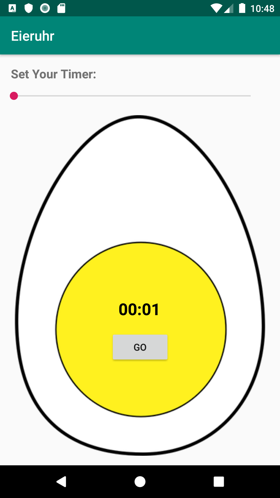

# Simple egg timer

This is a simple egg timer for android.

### Screenshot: 

## Change this
  If you want to use this app, change this.
If you don't want to make changes in the code, then take the same assets and place them in the same directory with the same name as i did

- In app/src/main/res/raw add a sound that should be played. I've added this sound: http://soundbible.com/1542-Air-Horn.html and named it airhorn.mp3
- In app/src/main/res/drawable add an image that should be displayed as background. I've used this image: https://publicdomainvectors.org/en/free-clipart/Vector-image-of-egg/4563.html and named it egg.png
